## Machine Learning

Notes from this class on Udemy. [here](https://www.udemy.com/machine-learning-with-javascript/learn/v4/overview)


## Tool Notes

### Debugger

```
$ node --inspect-brk index.js
```

Open Chrome and go to `about:inspect`. Here you should see a Remote Target listed. Click `inspect`.

### Lodash

Pros:

* Methods for almost everything we need
* Great API design
* Skills are transferrable to other JS projects

Cons:

* Very slow (relatively)
* Not 'numbers' focused
* Some things are awkward

### Tensorflow JS

Makes working with numbers in arrays of arrays really easy.

[js.tensorflow.org](https://js.tensorflow.org/)

Pros:

* Similar API to Lodash
* Extremely fast for numeric calculations
* Has a 'low level' linear algebra API + higher level API for ML
* Similar api to Numpy - popular Python numerical lib

Cons:

* Still in active development


## Steps for machine learning

If something changes then something else might change.

* Identify data that is relevant to the problem
* Assemble a set of data related to the problem you're trying to solve
* Decide on the type of output you are predicting
* Based on the type of output, pick an algorithm that will determine a correlation between your 'features' and 'labels'
* Use model generated by algorithm to make a prediction

Features are categories of data points that affect the value of a 'label'

### Identifying Data Needed (Identifying Data)

Look at the problem you're trying to solve and decide what type of data you need.

### Getting data (Assembling Data)

You may need to search multiple sources for data. Often data doesn't come in cleaned up packages so you will need to create the data on your own.

### Type of Data We Might Try to Predict (Type of Output)

* `Classification` - The value of our labels belong to a discrete set.
  * Based on how many hours a student studied for an exam, did they PASS or FAIL (PASS or FAIL)
  * Based on the content of this email, is it SPAM or NOT SPAM (SPAM or NOT SPAM)
  * Based on where a football player shoots from, are they likely to SCORE or NOT SCORE (SCORE or NOT SCORE)
* `Regression` - The value of our labels belong to a continuous set.
  * Based on the year, make, and model of a car, what is it's value? ($0 - $50k)
  * Based on an individual's daily calorie intake and minutes spent exercising, what is their weight? (80lb - 400lb)
  * Based on the height of this pine tree, what is it's age? (0 years - 500 years)


### Picking an Algorithm

Select an algorithm that fits the data selection and desired output.

### Use model to predict

Use your decided algorithm and dataset to try to make a prediction.


## Plinko

`/projects/plinko/` Given some data about where a ball is dropped from, can we predict what bucket it will end up in?

* Where are we dropping the ball
* Range of Ball Bounciness
* Range of Ball Size (how large the ball is)

This problem will have 3 features and one label.

* Features (Changing one of these)
  * Drop Position
  * Ball Bounciness
  * Ball Size
* Labels (Will probably change this)
  * Buckets a ball lands in

### Approaches

Array of Objects Approach - can get confusing when parsing

```
  [
    { dropPosition: 300, bounciness: 0.4, ballSize: 16, bucket: 4 },
    { dropPosition: 300, bounciness: 0.4, ballSize: 16, bucket: 4 },
    { dropPosition: 300, bounciness: 0.4, ballSize: 16, bucket: 4 },
    { dropPosition: 300, bounciness: 0.4, ballSize: 16, bucket: 4 }
  ]
```

Array of Array Approach - Need to keep track of what index means what

```
  [
    [300, 0.4, 16, 4],
    [350, 0.4, 25, 5],
    [416, 0.4, 16, 4],
    [722, 0.4, 16, 7]
  ]

```

### Type of Output

Since we are trying to determine which bucking the ball will fall into, this would be a `Classification` since there are a finite amount of buckets.

### Algorithm Selection

`K-Nearest Neighbor (knn)` - "Birds of a feather flock together"

`k` = number of records to use once sorted (this will be tweaked depending on your solution)

* `Features` - Data being used to predict an outcome
* `Labels` - Data you're trying to predict the outcome of
* `Test Data` - Data you are using to determine accuracy
* `Training Data` - Data you are using to as your main dataset
* `Feature Normalization` - Putting data on a scale of 0 - 1 instead of any value (find min max of set of data and scale it proportionally)
* `Common Data Structures` - Arrays of arrays
* `Feature Selection` - Selecting `features` based on their accuracy and ability to predict an outcome


#### Examples

##### Single Variable

Working Example Code `./problems/plinko/score-single-variable.js`

Which Bucket will a ball go into if dropped at 300px.

* Drop a ball a bunch of times around the board, record which bucket it goes into
* For each observation, subtract drop point from 300px, take absolute value (this determines how close it is to the 300px drop we are trying to guess)
* Sort the results from least to greatest
* Look at the 'k' top records. What is the most common bucket? (k is a number of records you are going to use to find the most common bucket)
* Whichever bucket came up most frequently is the one ours will probably go into

__

* Create a dataset, here the data array is `[dropPosition, bounciness, size, bucketLabel]`


```
function onScoreUpdate(dropPosition, bounciness, size, bucketLabel) {
  outputs.push([dropPosition, bounciness, size, bucketLabel]);
}
```

* Get the distance between two pieces of the same data

```
function distance(pointA, pointB) {
  return Math.abs(pointA - pointB);
}
```

* Set the `testSetSize` to be how many test example you want to use (this needs to be refined depending on the dataset)
* Split the dataset into the `testSet` and the `trainingSet`
  * `trainingSet` - The set of data you're going to sort and organize to come up with a prediction
  *  `testSet` - The set of data you're going to use as a case to test the results from the `trainingSet`
* Loop through a set of `k` ranges (needs to be refined by developer)
* filter each set of data in the `testSet` run through the `knn` method passing the `trainingSet` and the `dropPosition` of that piece of the `testSet`, then compare the resulting bucket to the actual bucket of the current piece of the `testSet` (see if the the predicted results are the actual results)
* Get the size of the filtered `testSet`
* Divide by the size of the of your testSet to get the % accuracy

```
function runAnalysis() {
	const testSetSize = 150;
	const [testSet, trainingSet] = splitDataset(outputs, testSetSize);

	_.range(7, 12).forEach(k => {
		const accuracy = _.chain(testSet)
		  .filter(testPoint => knn(trainingSet, testPoint[0], k) === testPoint[3])
			.size()
			.divide(testSetSize)
			.value();
			console.log('It is accurate ', accuracy*100, '% of the time using a k value of ', k);
	});

```

Get the absolute distance between the training piece of data (dropPoint) and these test set result (bucket), sorting by relevance/most similar (lowest to highest), getting the `k` top most similar matches, count the occurrences of certain results (bucket) for most similar distances. Return.

* Accept `data`, `point`, `k`
  * `data` - set of data (training set)
  * `point` - point of data you want to test for (variable you're testing for)
  * `k` - size of sample to take from sorted `data`
* map through all training set data and get the absolute distance between the training set's dropPosition and the test sets dropPosition. Add it to an array and also add the training set data's resulting bucket `['distance dropPosition', 'result from this training set']`
* sort by first element in the resulting array (this will be lowest the greatest, aka most similar to least similar by dropPosition)
* Slice the sorted array by `k` value, getting the first `k` most similar matches
* countBy to make an object map that counts the occurrences of a certain bucket/result for the `k` most similar training sets
* toPairs - covert key - value pair to arrays
* sort the arrays by the the value ([1] index) (sorting by the most occurrences)
* get the last array (one with the highest count)
* get the first element in the above array (most common resulting bucket)
* turn into a number

```
function knn(data, point, k) {
	return _
	  .chain(data)
	  .map(row => [ distance(row[0], point), row[3] ] )
	  .sortBy(row => row[0])
	  .slice(0, k)
	  .countBy(row => row[1])
	  .toPairs()
	  .sortBy(row => row[1])
	  .last()
	  .first()
	  .parseInt()
	  .value();
}
```

##### Multiple Variables

Which Bucket will a ball go into if dropped at 300px and the bounciness was 0.5.

* Drop a ball a bunch of times around the board, record which bucket it goes into
* For each observation, find the distance from the observation to prediction point of (300, 0.5)
* Sort the results from least to greatest
* Look at the `k` top records. What is the most common bucket?
* Whichever bucket came up most frequently is the one ours will probably go into

To calculate multiple variable we essentially use the Pythagorean Theorem `C^2 = A^2 + B^2` where the hypotenuse will be the true distance between two points. In the below, we would be calculating the distance between the blue point and the green point using the Pythagorean Theorem.

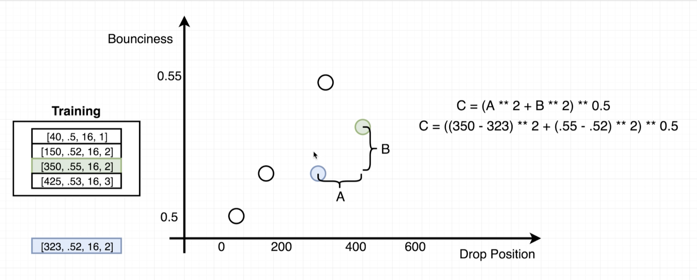


If you have more than 2 variable you can imagine this takes place on a 3D graph, using the Pythagorean Theorem is still quite simple.

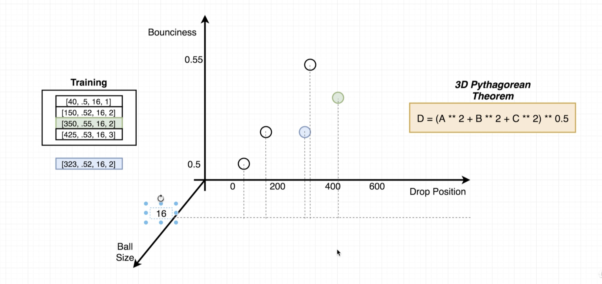


##### Normalization

You will want to normalize or standardize you data so they fall on the same scale of 0 - 1.

`(NORMALIZED DATASET) = (FeatureValue - minOfFeatureValues) / (maxOfFeatureValues - minOfFeatureValues)`

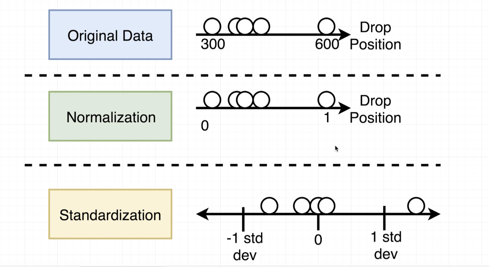


##### Feature Selection

You may consider if the change to a certain feature makes predictable changes to the output while changes of may not make predictable changes. In the example of the ball drop changes to the *dropPosition* make far more predictable change to the outcome compared to changes to the ball bounciness. Selecting which features to include in an analysis is called `Feature Selection`. You may decide to remove a `feature` from the analysis if it is too unpredictable or throws off the results.

In `knn` analysis, you could run the analysis with each feature to determine the most important features (one's with more accuracy). Also, you're looking for a % accuracy significantly above just guessing.
__


### TensorFlow Notes

[js.tensorflow.org](https://js.tensorflow.org/)

* `Tensor` Array like container that has data inside
* `Dimensions`
  * `1 Dimension` - [ 200, 400, 600 ]
  * `2 Dimensions` - [[200, 400], [600, 800]]
  * `3 Dimensions` = [[[1, 2, 3], [4, 5, 6]], [[7, 8, 9], [10, 11, 12]]]
* `Shape` - How many records in each dimension? Remember: [#rows, #columns, ...]
  * Example [5, 10, 15] - Shape : [3]
  * Example [[5, 10, 15], [18, 4, 2]] - Shape [2, 3]
  * Example [[[5, 10, 17]]] - Shape [1, 1, 3]


#### Broadcasting

Merge together two tensors with a specific operator

```
const data = tf.tensor([1, 2, 3]);
const otherData = tf.tensor([4, 5, 6])

// create a new tensor and adds the numbers at the same index together
data.add(otherData);

// create a new tensor and subtracts the numbers at the same index together
data.sub(otherData)

// multiply
data.mul(otherData)

// divide
data.div(otherData)

```
With Multiple Dimensions

```
const data1 = tf.tensor([[1, 2, 3], [4, 5, 6]]);
const data2 = tf.tensor([[7, 8, 9], [10, 11, 12]]);

data1.add(data2)
```

Broadcasting is when the shape of two tensors are the same OR the second one is equal to 1

In the below example, there are the following shapes:

```
[3]
[1]
```

3 and 1 are not equal, but since the second one is [1], broadcasting will be allowed.

```
const data = tf.tensor([1, 2, 3]);
const otherData = tf.tensor([4]);

data.add(otherData) // [5, 6, 7];

```
Working right to left, 3 is not equal to 1, but 1 the second one is a 1. Then, 2 is equal to 2 so these tensors can be broadcast.

```
[2, 3]
[2, 1]
```

```
const data = tf.tensor([[1, 2, 3], [4, 5, 6]]);
const otherData = tf.tensor([[1], [1]]);

data.add(otherData) // [5, 6, 7];

```

DOES allow Broadcasting
```
[2, 3, 2]
   [3, 1]
```

DOES NOT allow Broadcasting
```
[2, 3, 2]
   [2, 1]
```

#### Print Value

To log the actual value of the `tensor` you can do `data.print()`

#### Accessing Data

```
const data = tf.tensor([10, 20, 30]);

data.get(0); // 10

const data2 = tf.tensor([[1, 2, 3], [4, 5, 6]])
data2.get(0, 2) // 3
```

#### Accessing many pieces of data

Below are 3 ways to access data using the `.slice` Method
Results for all will be the same: `[[20], [50], [20], [50], [20], [50], [20], [50]]`

```
const data = tf.tensor([
	[10, 20, 30],
  [40, 50, 60],
  [10, 20, 30],
  [40, 50, 60],
  [10, 20, 30],
  [40, 50, 60],
  [10, 20, 30],
  [40, 50, 60]
]);

// start row 0, start column 1
// row size 8, columns width 1
data.slice([0, 1], [8, 1]);
data.slice([0, 1], [data.shape[0], 1]);
data.slice([0, 1], [-1, 1]);
```

#### Concat

The second argument is which axis to concat with. 0 is concat with the rows and 1 is concat with the columns

Results of the below:

`[[1, 2, 3, 4 , 5 , 6 ], [7, 8, 9, 10, 11, 12]]`

```
const tensorA = tf.tensor([
  [1, 2, 3],
  [7, 8, 9]
]);

const tensorB = tf.tensor([
  [4, 5, 6],
  [10, 11, 12]
]);


tensorA.concat(tensorB, 1)
```

Add first tensor rows and concat onto other data

Results:

`[[183, 1, 182], [140, 2, 173], [180, 3, 186], [166, 4, 190]]`

```
const jumps = tf.tensor([
  [70, 40, 73],
  [62, 53, 25],
  [61, 65, 54],
  [59, 34, 73]
]);

const otherData = tf.tensor([
  [1, 182],
  [2, 173],
  [3, 186],
  [4, 190]
]);

jumps.sum(1).expandDims(1).concat(otherData, 1);

```

### TensorFlow Examples

#### Calculating Error %

`ERROR = (EXPECTED VALUE) - (PREDICTED VALUE) / (EXPECTED VALUE)`

#### Standardization

`STANDARDIZATION = (VALUE - AVERAGE) / (STANDARD_DEVIATION)`

OR

`STANDARDIZATION = (VALUE - AVERAGE) / sqrt(VARIANCE)`

```
const numbers = tf.tensor([
	[1, 2],
  [3, 4],
  [5, 6]
]);

const { mean, variance } = tf.moments(numbers, 0);

numbers.sub(mean).div(variance.pow(.5))

```

## Linear Regression

Trying to find an `independent variable` equation that correlates to a `dependent variable`. You can have as many `Independent Variables` that you want

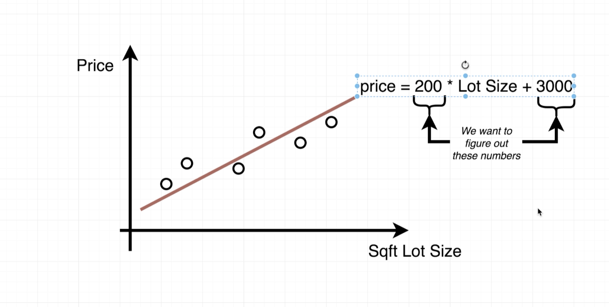

Pros:

* Fast! Only train one time, then use for any prediction.
* Uses methods that will be very important in more complicated ML

Cons:

* Lot harder to understand intuitively

Methods of Solving Linear Regression:

* Ordinary Least Squares
* Generalized Least Squares
* ... others
* Gradient Descent

___

First you are going to guess what the solution is (even if it's a really bad guess). In the below example you might do an initial guess of `0(Lot Size) + 1`, which mean the price will initially guessed at $1000.

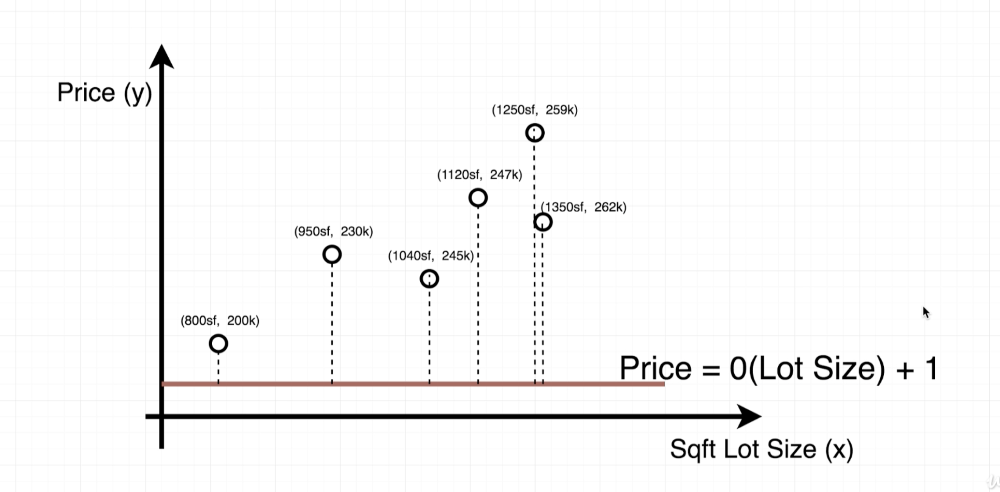

Then we can use this equation to guess how wrong we were. Basically this equation means "subtract the actual result from the guess and square it for every guess, then add them all together"

So in the above that would be:

`((1 - 200)^2 + (1 - 230)^2 + (1 - 245)^2 + (1 - 274)^2 + (1 - 259)^2 + (1 - 262)^2) / n`

or

`360792 / 6 = 60132`

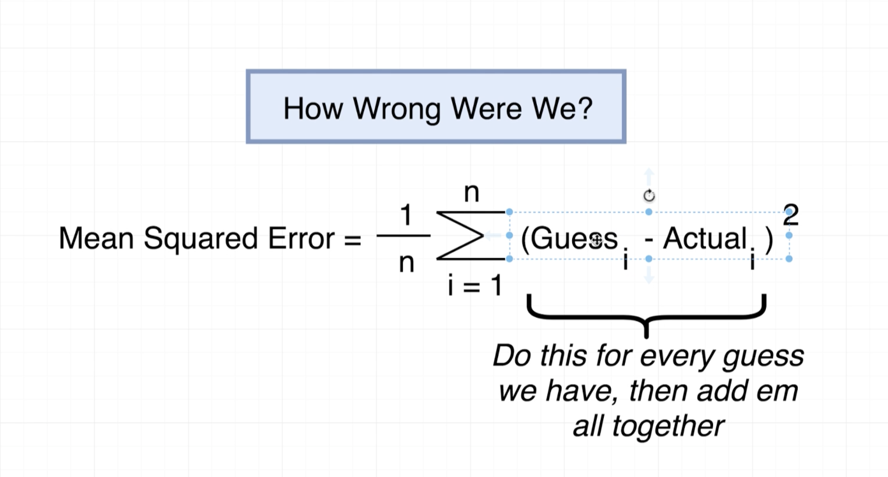


Then we make a new guess `0(Lot Size) + 200`

`((200 - 200)^2 + (200 - 230)^2 + (200 - 245)^2 + (200 - 274)^2 + (200 - 259)^2 + (200 - 262)^2) / n`

or

`15726 / 6 = 4287`

Since the result of this guess is lower than the first one, this guess must be better than the first.


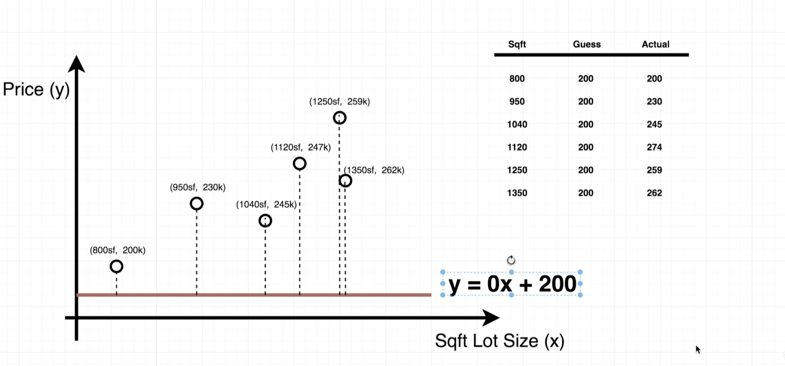

Ultimately, we are trying to guess `m` and `b` to get the lowest result of the above

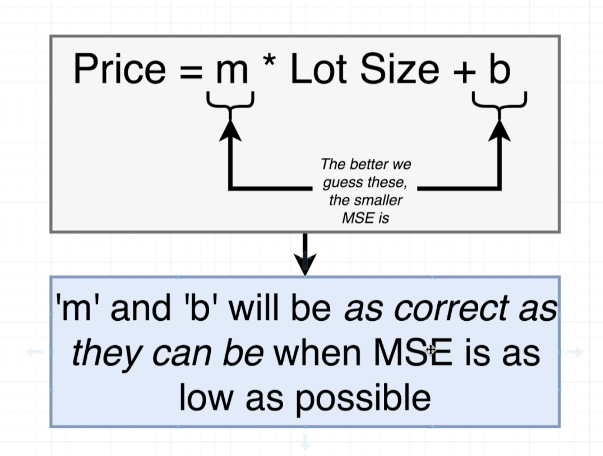

### How to guess

Instead of trying to guess `b` randomly, it's more useful to determine the slope of the graph between two guesses. The more vertical the slope, the farther away from the answer it is.

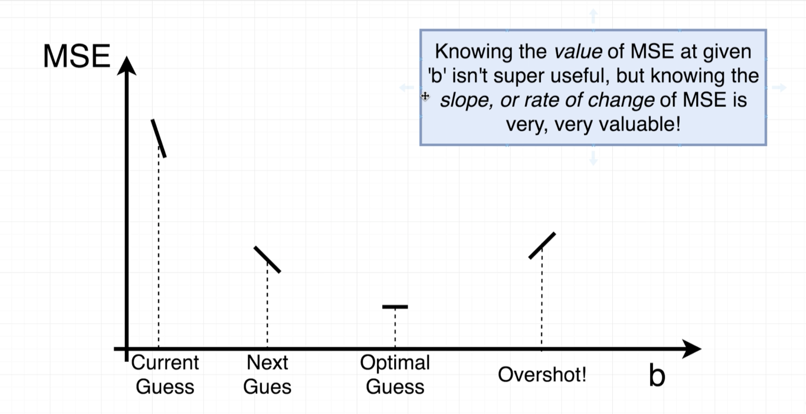

____

The derivative of an equation gives a new equation that tells us the slope at any location.

[More Info Here](https://www.wolframalpha.com/input/?i=derivative+x%5E2+%2B+5)

`y = x^2 + 5` or `(dy / dx) = 2x`


#### Gradient Descent

* Pick a value for `b` and `m`
* Calculate the slope of `MSE` with respect to `m` and `b`
* Are both slopes very small? If so, we are done!
* Multiply both slopes by learning rate
* Subtract that from `b` and `m`

What we know:

[Excel Example](https://docs.google.com/spreadsheets/d/1gRkBOSPznQZeRc5-cXtyR2AujGaY0GdOJhpPrODsK8w/edit#gid=0)

* We want to find an equation that relates an independent variable and a dependent variable
* We can guess at values of `b`, then use `Mean Squared Error` to figure out how wrong we were
* The slope, or rate of change of `MSE` can be used to figure out whether our `b` value was too high or low
* Take the `slope` of `MSE` at `b` using the derivative of the `MSE` equation
* Subtract the slope from `b` to update our guess

`House Price = m * (Sqft Lot) + b`

## Matrix Multiplication

* Are two matrices eligible to be multiplied together?
* What's the output of matrix multiplication?
* How is matrix multiplication done?

If the inner values of the the shape (in blue below) are the same, then they can be multiplied. The shape of the new matrix, will be the outer values.

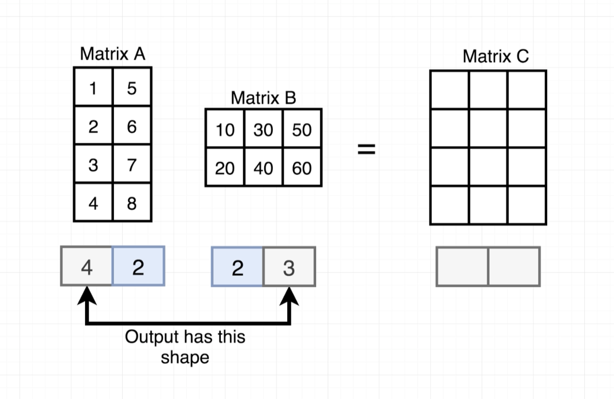

How to math works:

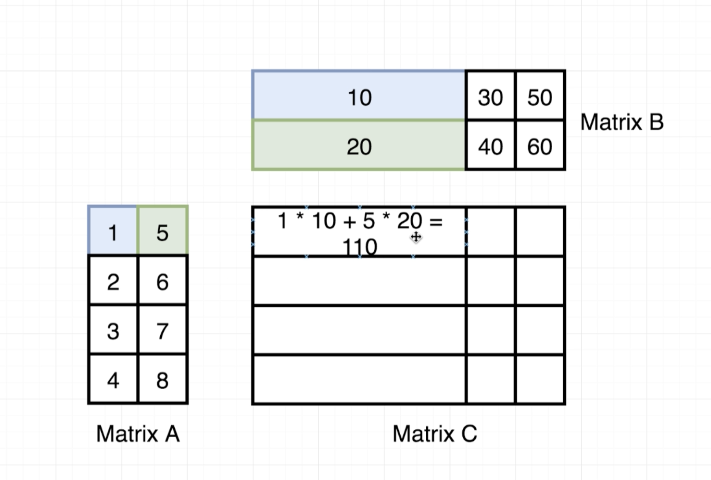

* Weights are values used to calculate a feature set

`(FEATURES * ((FEATURES * WEIGHTS) - LABELS)) /  n`

`Multivariate Linear Regression` - `y = b + (m1 * x1) + (m2 * x2) + (m3 * x3)`

## Learning Rate Optimization Methods

* Adam
* Adagrad
* RMSProp
* Momentum

### Custom Learning Rate

* With every iteration of GD, calculate the exact value of MSE and store it!
* After running an iteration of GD, look at the current MSE and the old MSE
* If the MSE went *up* then we did a bad update, so divide learning rate by 2
* if the MSE went *down* then we are going in the right direction! Increate LR by 5%
